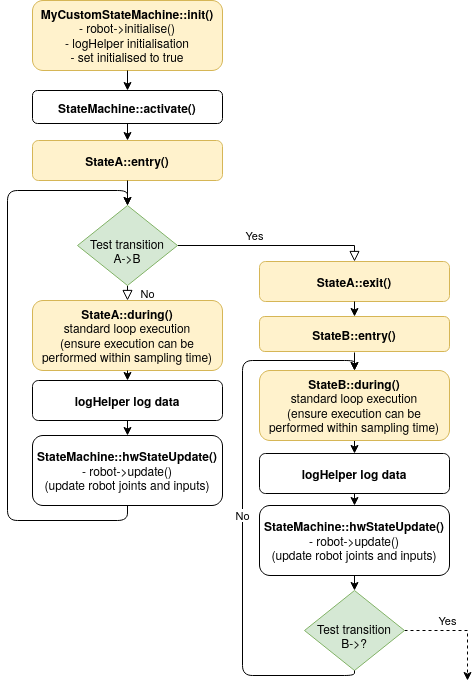

# Building a custom application (with a custom state machine)

Each CORC application is a dedicated state machine with its own states which have access to your specific robot.


## Setup

To create a custom application with custom state machine, two things must be done. 

First, the source code itself must be developed, by deriving the StateMachine class can be to a custom one, named `MyCustomStateMachine`, in files named `MyCustomStateMachine.h/cpp`. These must be placed in a dedicated subfolder in the apps folder with a consistent name (e.g. `MyCustomStateMachine` must be used for both the folder and the file names)

Secondly, CMakeLists.txt must be edited and the entry `set (STATE_MACHINE_NAME "ExoTestMachine")` changed to `set (STATE_MACHINE_NAME "MyCustomStateMachine")`.

That's it, simply use the same build procedure.

> Note: It is recommended to use one of the existing application (X2DemoMachine or M3DemoMachine) as a template for your new state machine: simply copy the app folder closest to your application and follow the steps above.

> Note: Additionnal code can be placed in the state machine folder. Every file placed in this folder (and subfolders) named in {.c, .cpp, .h}  will be compiled.


## State machine structure and custom states and transitions

CORC provides a structured way to build event driven Finite State Machines.

The execution flow of a typical state machine with two states A and B is shown on this diagram and detailed below.
   
   
   
Yellow parts highlights the methods which needs to be overriden with custom application code whereas Green blocks represents transitions that needs to be setup.

### States

Each state is a custom class, derived from the generic `State`. It contains three main methods which should be overidden to include your custom code:
- `virtual void entry()` which is called once when entering the state
- `virtual void during())` which is called repeatidly by the main control loop and which manage the normal control execution. The code within this state should be executable within less time than the sampling period.
- `virtual void exit()` which is called once when exiting the state (either by transition or when program ends).

For example the SittingDown class in the ExoTestmachine:

```C++
void SittingDwn::entry(void) {
    cout << " GREEN -> SIT DOWN " << endl
    trajectoryGenerator->initialiseTrajectory(SIT, 1);
    robot->startNewTraj();
}
void SittingDwn::during(void) {
    robot->moveThroughTraj();
}
void SittingDwn::exit(void) {
    std::cout << "Sitting Down State Exited " << endl;
}
```

States objects to be used should then be defined in your state machine constructor and an initialisation State should be selected:
```C++
MyCustomStateMachine::MyCustomStateMachine() {
    robot = new X2Robot(); //Create the robot object to be used by the state machine

    stateA = new StateAState(this, robot); //Create a StateA object
    stateB = new StateBState(this, robot); //Create a StateB object
    
    ...
    
    StateMachine::initialize(stateA); //Define which state to call at start of state machine
}
```

### Events and transitions

Events are used to trigger transitions from one state to another. They could be based on a sensor trigger, timer, internale state... 
Programmatically, CORC represents events as single method objects with a boolean method `virtual bool check()` which should return true when the transition(s) should happen.

To create a new event:
- Define a new event within your state machine class: `EventObject(AtoBevent_t) * AtoBevent;`
- Instantiate it in your constructor: `AtoBevent = new AtoBevent_t(this);`
- Define it's trigger boolean method:
```C++
bool MyCustomStateMachine::AtoBevent::check() {
    if (OWNER->robot->keyboard.getA() == true) {
        return true;
    }
}
```

Once events have been declared, they can be used to trigger transitions between states. This is done by creating a new transition using the MACRO `NewTransition(_from_, _event_, _to_)` :
```C++
    NewTransition(stateA, AtoBevent, stateB);
    NewTransition(stateB, backToBevent, stateA);
```

Note that the same event can be used by multiple transitions. Multiple transitions (with different events) can also be used for the same state: the go to state being selected by the event being triggered.

Finally a complete state machine constructor look like:

```C++
MyCustomStateMachine::MyCustomStateMachine() {
    robot = new X2Robot(); //Create the robot object to be used by the state machine

    stateA = new StateAState(this, robot); //Create a StateA object
    stateB = new StateBState(this, robot); //Create a StateA object
    
    AtoBevent = new AtoBevent_t(this);
    backToBevent = new backToBevent_t(this);
    
    NewTransition(stateA, AtoBevent, stateB);
    NewTransition(stateB, backToBevent, stateA);
    
    StateMachine::initialize(stateA); //Define which state to call at start of state machine
}
```

## Extending

### Third-party libraries

Additionnal third-party libraries required in your code can either directly be placed in the lib folder for headers-only libraries or added as packages in the CMakeList.


### ROS

To use ROS in your application, see this [specific page](../1.GettingStarted/Simulation.md).
